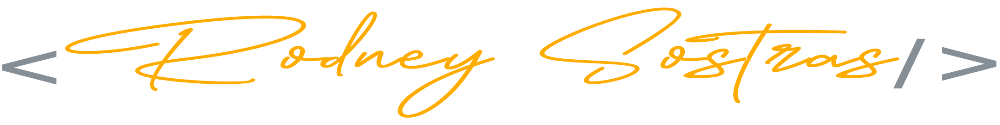

  
  
  <h2>Olá, me chamo Rodney Sostras, sou Desenvolvedor Front-end</h2>

Estou focado e crescendo nas tecnologias voltada para web, 
tenho experiência com desenvolvimento da parte de front-end 
agora estou se aprimorando em tecnologia back-end,
o meu objetivo e se torno um desenvolvedor Full stack.

    
    
    
    
    

### 🤩 Tecnologias que tenho competência

### 📚 Tecnologias que estou aprimorando

---

  
  

<!--  -->
<!--  -->
<!--  -->
<!--  -->
<!--  -->
