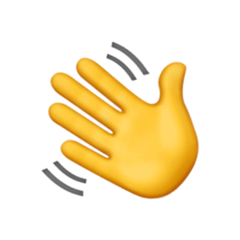

  

 

<h2>&nbsp;Ola! Eu sou Rodney</h2>

### 👨🏻‍💻 &nbsp;Sobre mim

💡 &nbsp;Gosto de explorar novas tecnologias e desenvolvedor soluções front-end.\
🎓 &nbsp;Atualmente, sou graduado em bacharel em Sistema de Informação.\
🌱 &nbsp;Estou no caminho certo para aprender mais sobre ReactJS & NodeJS.\
💬 &nbsp;Sinta-se à vontade para entrar em contato comigo.\
✉️ &nbsp;Você pode me enviar um e-mail para rodney.sostras@gmail.com! Vou tentar responder assim que puder.\
📄 &nbsp;Por favor, dê uma olhada no meu [curriculum](https://rodneysostras.github.io/curriculo) para mais detalhes sobre mim. Estou aberto a comentários e sugestões!

### 🛠 &nbsp;Tecnologias
&nbsp;
&nbsp;
&nbsp;
&nbsp;
&nbsp;
&nbsp;
&nbsp;
&nbsp;
&nbsp;
&nbsp;

### 🤝🏻 &nbsp;Onde me encontrar

    &nbsp;
    &nbsp;
    &nbsp;
    &nbsp;

### ⚙️ &nbsp;GitHub Analytics

  
  

<!--
**rodneysostras/rodneysostras** is a ✨ _special_ ✨ repository because its `README.md` (this file) appears on your GitHub profile.

Here are some ideas to get you started:

- 🔭 I’m currently working on ...
- 🌱 I’m currently learning ...
- 👯 I’m looking to collaborate on ...
- 🤔 I’m looking for help with ...
- 💬 Ask me about ...
- 📫 How to reach me: ...
- 😄 Pronouns: ...
- ⚡ Fun fact: ...
-->
